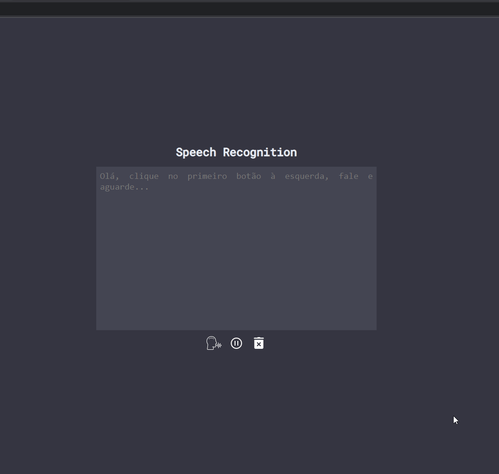
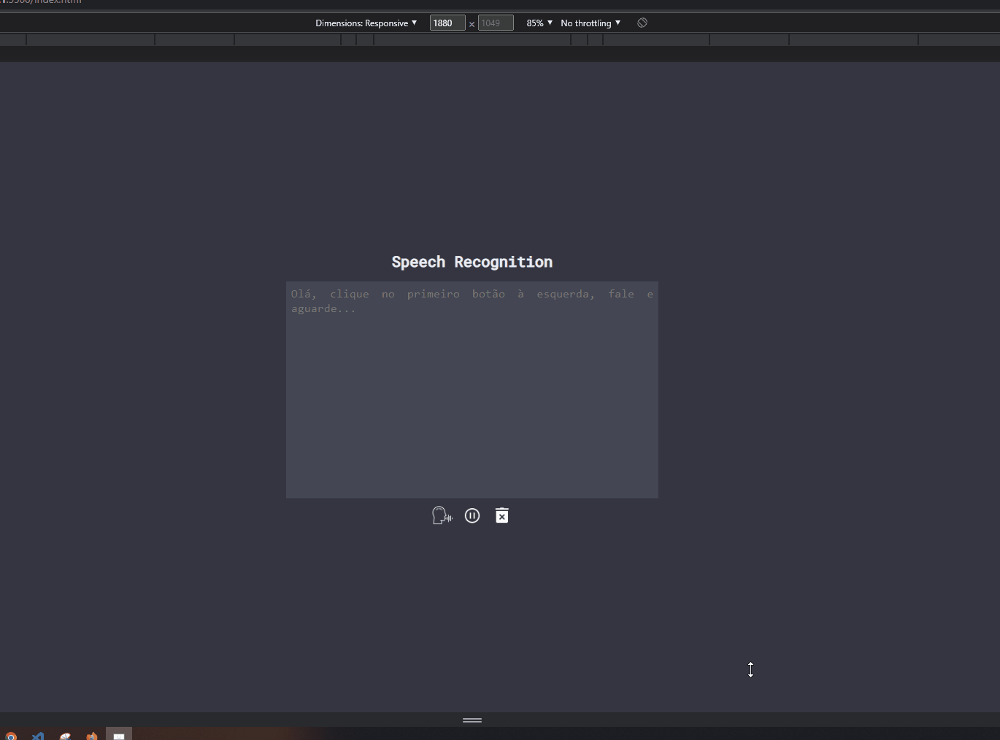

# Projeto Speech To Text

### Implementei esse projeto utilizando a Web API - Speech Recognition. O projeto consiste em uma página onde o usuário fala algo e logo em seguida essa fala é transcrita na tela.

👀 Dá uma olhada aqui: <https://thiago-levi.github.io/projeto-speech-to-text/>

Infos:

- Exibe um área de texto contendo a fala do usuário.
- Exibe o texto de forma continua em relação ao que é falado.

Infos extras:

- Implementei a resposividade da página

## Tecnologias

  

---

<h2 align="center">Versão Web</h2>

 
___

<h2 align="center">Versão Mobile</h2>

